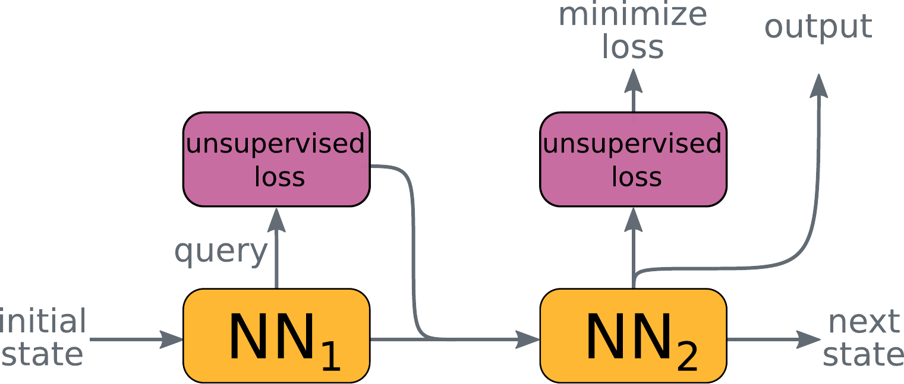

# Goal-Aware Neural SAT Solver

This repository contains the official TensorFlow implementation of the following paper:
> **Goal-Aware Neural SAT Solver**
> 
> by  Emils Ozolins, Karlis Freivalds, Andis Draguns, Eliza Gaile, Ronalds Zakovskis, Sergejs Kozlovics 
> 
> [[arXiv]](https://github.com/LUMII-Syslab/QuerySAT)
> 
>  Abstract: _Modern neural networks obtain information about the problem and calculate the output solely from the input values. We argue that it is not always optimal, and the network's performance can be significantly improved by augmenting it with a query mechanism that allows the network to make several solution trials at run time and get feedback on the loss value on each trial. To demonstrate the capabilities of the query mechanism, we formulate an unsupervised (not dependant on labels) loss function for Boolean Satisfiability Problem (SAT) and theoretically show that it allows the network to extract rich information about the problem. We then propose a neural SAT solver with a query mechanism called QuerySAT and show that it outperforms the neural baseline on a wide range of SAT tasks and the classical baselines on SHA-1 preimage attack and 3-SAT task._


The proposed query mechanism works by producing a query, evaluating it using an unsupervised loss function, and passing the resulting value back to the neural network for interpretation. It allows the model to obtain the structure and meaning of the solvable instance and information about the expected model output. The same unsupervised loss can be used for evaluating the query and for training.

## Requirements

To install requirements:

```setup
pip install -r requirements.txt
```

## Hardware requirements

* Ubuntu 20.04 or equivalent
* Nvidia T4 (16Gb) or better
* 16GB of RAM

## Training

To train the model(s) in the paper, run this command:

```train
python train.py --input-data <path_to_data> --alpha 10 --beta 20
```

>📋  Describe how to train the models, with example commands on how to train the models in your paper, including the full training procedure and appropriate hyperparameters.

## Evaluation

To evaluate my model on ImageNet, run:

```eval
python eval.py --model-file mymodel.pth --benchmark imagenet
```

>📋  Describe how to evaluate the trained models on benchmarks reported in the paper, give commands that produce the results (section below).

[comment]: <> (## Pre-trained Models)

[comment]: <> (You can download pretrained models here:)

[comment]: <> (- [My awesome model]&#40;https://drive.google.com/mymodel.pth&#41; trained on ImageNet using parameters x,y,z. )

[comment]: <> (>📋  Give a link to where/how the pretrained models can be downloaded and how they were trained &#40;if applicable&#41;.  Alternatively you can have an additional column in your results table with a link to the models.)

## Results

Our model achieves the following performance on :

| Model       | k-SAT  | 3-SAT  | 3-Clique | k-Coloring | SHA-1 |
| ----------- |--------| ------ |----------|----------- |-------|
| QuerySAT    | 99.05% | 93.32% | 94.74%   | 98.32%     | 46.57%|
| NeuroCore   | 50.82% | 57.63% | 1.04%    | 0.0%       | 0.24% | 

>📋  Include a table of results from your paper, and link back to the leaderboard for clarity and context. If your main result is a figure, include that figure and link to the command or notebook to reproduce it. 


## Contributing
For help or issues, please submit a GitHub issue.
For personal communications, please contact Emīls Ozoliņš (emils.ozolins@lumii.lv).
